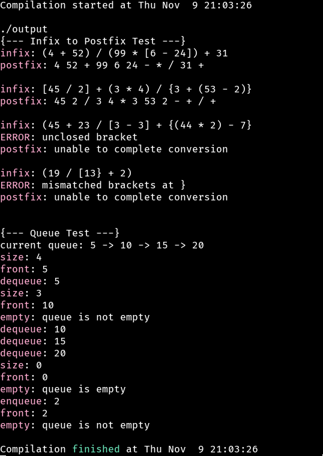

# Details
A function which converts an infix expression to a postfix expression, as well as a function that validates enclosing glyph placement (parenthesis, brackets and braces).

A template class for a queue datastructure, emplemented using the standard library linked list as the container.

# How to run
The provided `Makefile` can build a binary using the GNU Compiler by default. On systems without the GNU Compiler, change the value of the `CXX` variable in the Makefile.

Build the program using the `make` command. The resulting binary will be called `output`. Run `./output` to see the result of the program, and run `make distclean` to remove the binary and object files, or `make clean` to remove only the object files.

# Screenshots

